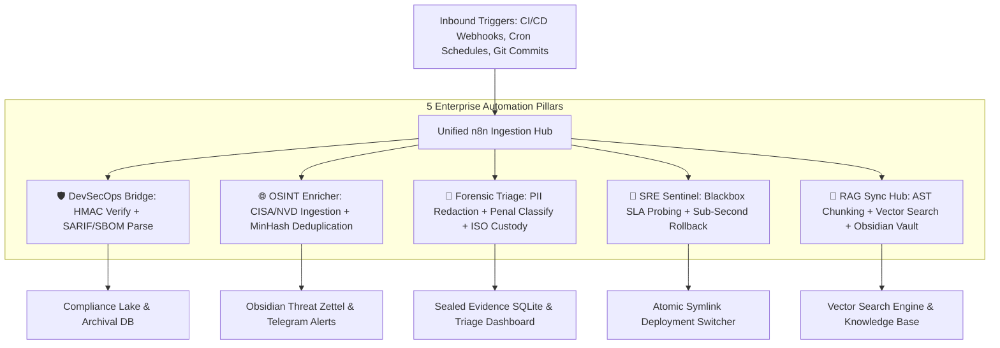

# ⚡ Enterprise n8n Workflow Automation Hub (`n8n-enterprise-automation-hub`)

[](https://github.com/cibi-dev/n8n-enterprise-automation-hub/actions/workflows/ci.yml)
[](https://python.org)
[](https://github.com/PyCQA/bandit)
[](https://n8n.io)
[](https://www.iso.org/standard/44381.html)
[](LICENSE)

An enterprise-grade, monorepo workflow automation suite consolidating **5 production-ready n8n workflow pipelines and native Python execution bridges**. Built with strict DevSecOps guardrails, cryptographic validation (constant-time HMAC-SHA256, ISO/IEC 27037 evidence sealing), MinHash LSH deduplication, synthetic SRE probing with zero-downtime blue/green rollbacks, and AST-driven RAG knowledge base synchronizers.

---

## 🏛️ Suite Architecture

```
+----------------------------------------------------------------------------------------------------+
|                             Unified CLI & Orchestrator (`n8n-hub` / `cli.py`)                      |
+----------------------------------------------------------------------------------------------------+
       |                  |                 |                  |                 |                 |
       v                  v                 v                  v                 v                 v
+--------------+  +---------------+  +--------------+  +---------------+  +---------------+  +--------------+
| 🛡️ devsecops |  | 🌐 osint      |  | 🔬 forensics |  | 🚨 sre        |  | 🧠 rag        |  | ⚡ workflows |
| DevSecOps    |  | OSINT Threat  |  | Forensic     |  | SRE           |  | RAG Knowledge |  | Production   |
| Audit Bridge |  | Feed Enricher |  | Incident     |  | Resilience    |  | Sync Hub      |  | JSON Flow    |
| (SARIF/SBOM, |  | (CISA/NVD,    |  | Triage       |  | Sentinel      |  | (AST Code &   |  | Engine       |
| HMAC-SHA256, |  |  MinHash LSH, |  | (PII Redact, |  | (Blackbox     |  |  Markdown     |  | (30 Configured|
| Anti-SSRF)   |  |  Obsidian/TG) |  |  ISO Custody)|  |  Rollback ms) |  |  Vector Index)|  |  Nodes)      |
+--------------+  +---------------+  +--------------+  +---------------+  +---------------+  +--------------+
```



---

## 📦 Consolidated Automation Engines

| Domain Engine | Package Directory | Trigger / Protocol | Primary Capabilities & Standards |
| :--- | :--- | :--- | :--- |
| **`devsecops`** | `packages/n8n-devsecops-audit-bridge` | Webhook (HTTP POST) | Constant-time HMAC-SHA256 (`CWE-208`), SARIF v2.1.0 parser, CycloneDX SBOM extraction, Anti-SSRF URL filtering (`CWE-918`). |
| **`osint`** | `packages/n8n-osint-threat-feed-enricher` | Cron Schedule (Hourly) | CISA KEV & NVD 2.0 CVE ingestion, MinHash LSH similarity ($O(1)$ near-duplicate filtering), Obsidian & Telegram dispatch. |
| **`forensics`** | `packages/n8n-forensic-incident-triage` | Webhook (HTTP POST) | Linear-time PII Sanitization (ReDoS safe), Penal classification heuristics, ISO/IEC 27037 SHA-256 evidence custody tokens. |
| **`sre`** | `packages/n8n-sre-resilience-sentinel` | Cron / Synthetic Probes | Blackbox endpoint SLA monitoring, consecutive failure thresholding, sub-millisecond atomic Linux symlink swap rollback. |
| **`rag`** | `packages/n8n-rag-knowledge-sync-hub` | Git Webhook / Poller | AST-based Python function/class chunking, Markdown header chunker, SQLite dense vector store, Obsidian MOC indexer. |

---

## 🚀 Quickstart

### 1. Integrated Multi-Engine Simulation (1 Command)

Run the full end-to-end multi-engine test pipeline locally:

```bash
# Execute end-to-end integration demo
python3 cli.py demo
```

### 2. Inspect Workflow Configurations

```bash
python3 cli.py workflows
```

### 3. Deploy via Docker Compose (n8n + Hub Runner)

```bash
# Launch n8n automation engine and runner container
docker-compose up -d

# Open n8n Web UI: http://localhost:5678
```

---

## 🛠️ Unified CLI Reference

The CLI entrypoint (`cli.py` / `n8n-hub`) allows direct testing, execution, and debugging of each module without requiring a full live n8n cluster:

```bash
# DevSecOps: Verify HMAC signature of audit payload
python3 cli.py devsecops verify-signature payload.json --signature sha256=... --secret my-secret

# OSINT: Ingest and deduplicate CISA KEV feed
python3 cli.py osint parse-cisa cisa_catalog.json

# Forensics: Sanitize raw incident text and seal evidence
python3 cli.py forensics triage incident.txt --id INC-2026-001

# SRE: Execute synthetic probe and check rollback
python3 cli.py sre check-and-remediate --url https://app.internal/health --link-path /srv/current --slots-dir /srv/slots

# RAG: Index codebase repository and query semantic vector store
python3 cli.py rag scan-and-sync /path/to/repo --db rag.db
python3 cli.py rag search "incident classification" --db rag.db
```

---

## 🔒 Security Standards & DevSecOps Compliance

This monorepo complies with the 17 Canonical Security Standards:

1. **Constant-Time Verification (CWE-208)**: All webhook signatures are verified using `hmac.compare_digest`.
2. **Anti-SSRF Protection (CWE-918)**: Outbound webhook dispatchers validate IP ranges and block loopback, link-local, and private subnets (`127.0.0.0/8`, `169.254.0.0/16`, `10.0.0.0/8`, etc.).
3. **Data Integrity & Non-Repudiation**: Evidence items are hashed using domain-separated SHA-256 tokens compliant with ISO/IEC 27037.
4. **ReDoS Immunity (CWE-1333)**: All regex sanitizers operate in strict linear time with pre-compiled patterns.
5. **Secure Containerization**: Multi-stage Docker builds running as non-root user (`n8n_operator:1001`).

---

## 🧪 Testing & Verification

Run the full suite test suite and static security analysis:

```bash
# Run pytest across the monorepo suite
pytest tests/ -v

# Run static security vulnerability scan with Bandit
bandit -r . -ll
```

---

## 📄 License

Licensed under the [MIT License](LICENSE).
