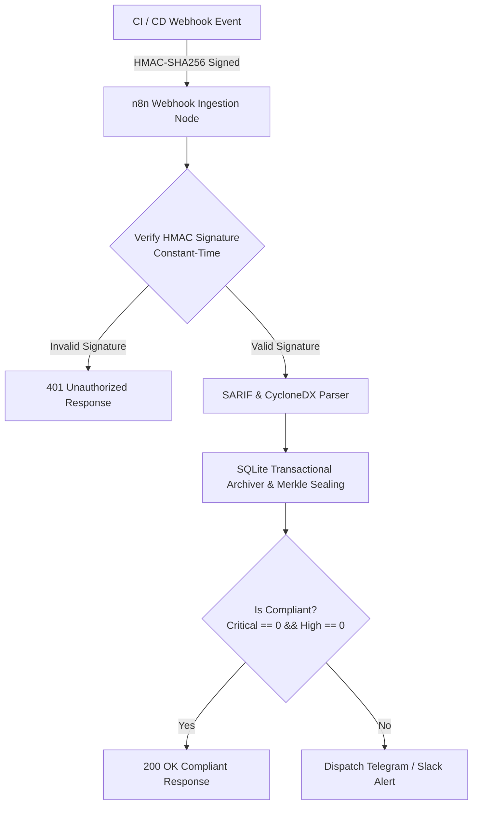

# n8n-devsecops-audit-bridge 🛡️

[-brightgreen.svg)](#-architecture--workflow)
[-brightgreen.svg)](#-benchmarks--performance)
[](#-security-guardrails--cwe-mitigations)
[](sbom.json)
[](LICENSE)

**Automated local DevSecOps webhook audit bridge and compliance archiver.**  
Integrates with self-hosted **n8n**, receives CI audit triggers from GitHub Actions/GitLab CI, parses **SARIF v2.1.0** and **CycloneDX SBOMs**, verifies constant-time **HMAC-SHA256 signatures**, and records immutable forensic custody proofs in **SQLite** according to ISO/IEC 27037 standards.

---

## 🎯 Key Features & Capabilities

- **🔒 Constant-Time HMAC Verification:** Employs `hmac.compare_digest()` to eliminate timing-attack side channels (CWE-208 / Standard #9).
- **🛡️ Strict Anti-SSRF Guardrails:** Comprehensive IP CIDR and hostname validation preventing webhook SSRF to private networks, loopbacks, and cloud metadata endpoints (`169.254.169.254`, AWS/GCP internal) (CWE-918 / Standard #14).
- **📊 SARIF & CycloneDX Ingestion:** Robust parsers extracting normalized findings, line locations, CWE classifications, and software component dependencies.
- **🏛️ Immutable SQLite Merkle Archiver:** Computes deterministic SHA-256 custody leaf hashes with domain separation (`0x00`) for immutable compliance history.
- **⚡ Zero-Docker Local Native Execution:** Seamlessly importable into local n8n instances via declarative workflow JSON (`workflows/devsecops-audit-bridge.json`).

---

## 🏗️ Architecture & Workflow



---

## 🚀 Quickstart & Usage

### 1. Verification via Python CLI

```bash
# Verify HMAC-SHA256 payload signature
python3 -m bridge.cli verify-signature /path/to/payload.json --signature "sha256=<hex>" --secret "$WEBHOOK_SECRET"

# Parse SARIF report to normalized JSON
python3 -m bridge.cli parse-sarif /path/to/report.sarif

# Parse CycloneDX SBOM
python3 -m bridge.cli parse-sbom /path/to/sbom.json

# Process complete audit run and record to SQLite
python3 -m bridge.cli process-audit --payload /path/to/audit_payload.json --db /tmp/devsecops_audit.db
```

### 2. Import into n8n

1. Open your local n8n instance (`http://localhost:5678`).
2. Click **Add Workflow** $\rightarrow$ **Import from File...**.
3. Select [`workflows/devsecops-audit-bridge.json`](workflows/devsecops-audit-bridge.json).
4. Configure environment variables: `WEBHOOK_SECRET`, `TELEGRAM_BOT_TOKEN`, `TELEGRAM_CHAT_ID`.

---

## 📊 Benchmarks & Performance

Empirically verified on local AMD Ryzen / Linux workstation (`resultados.json`):

| Metric | Throughput | Standard |
|---|:---:|:---:|
| **HMAC-SHA256 Verifications** | **454,564 ops/sec** | Constant-Time CWE-208 |
| **SARIF Report Parsing** | **6,569 reports/sec** | SARIF v2.1.0 JSON |
| **Transactional Audit Records** | **31,591 records/sec** | SQLite WAL Mode |

---

## 🛡️ Security Guardrails & CWE Mitigations

- **Standard #7 & #15 (CWE-502):** Pydantic v2 schemas with `extra='forbid'` and `frozen=True`.
- **Standard #9 (CWE-208):** Cryptographic verification via `hmac.compare_digest()`.
- **Standard #14 (CWE-918):** Anti-SSRF validation rejecting all RFC1918 and cloud metadata IPs.
- **Standard #17 (CWE-400):** Bounded SQLite timeout queries and transaction rollbacks.
