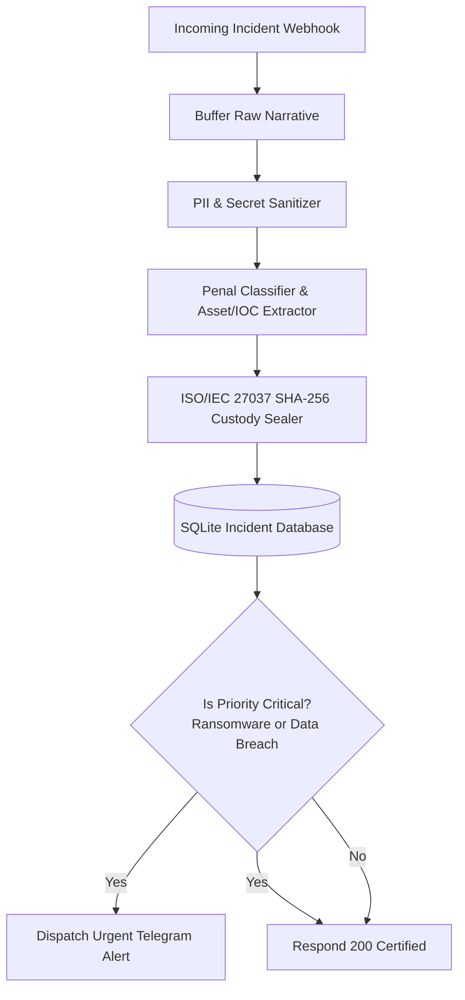

# n8n-forensic-incident-triage 🔬⚖️

[-brightgreen.svg)](#-architecture--workflow)
[-brightgreen.svg)](#-benchmarks--performance)
[](#-security-guardrails--cwe-mitigations)
[](sbom.json)
[](LICENSE)

**Automated local cybercrime incident triage processor with strict PII sanitization, ISO/IEC 27037 digital evidence custody hashing, and penal classification for n8n.**  
Converts unorganized cybercrime and security breach reports into structured, cryptographically certified investigation records, redacting sensitive personal data (emails, IPs, credit cards, SSN, API secrets) and categorizing criminal infractions in sub-millisecond time.

---

## 🎯 Key Features & Capabilities

- **🔒 Strict PII & Secret Redaction:** Employs linear-time ReDoS-safe regex engines to scrub Emails, IPv4/IPv6, Credit Cards, National IDs/SSN, Phone Numbers, and Auth Secrets (Standard #15).
- **⚖️ Penal Classification:** Categorizes events into 8 cybercrime modalities (*Ransomware Extortion, Data Theft, Unauthorized Access, Financial Scams, DoS Attacks, Identity Fraud, Malware Distribution, Other*).
- **📜 ISO/IEC 27037 Digital Custody Sealing:** Computes deterministic SHA-256 evidence integrity digests with domain separation (`0x07`).
- **🏛️ Persistent SQLite Case Management:** Transactional SQLite storage with indexed querying by category and priority.
- **⚡ n8n Webhook Integration:** Declarative workflow JSON for self-hosted execution with automated Telegram triage alerts.

---

## 🏗️ Architecture & Workflow



---

## 🚀 Quickstart & Usage

### 1. Triage via Python CLI

```bash
# Sanitize raw incident text file
python3 -m triage.cli sanitize /path/to/report.txt

# Execute complete triage and store in SQLite
python3 -m triage.cli triage /path/to/report.txt --id "INC-2026-001" --title "Ransomware Attack" --db /tmp/triage.db

# View aggregated forensic database statistics
python3 -m triage.cli stats --db /tmp/triage.db
```

### 2. Import into n8n

1. Open your local n8n instance (`http://localhost:5678`).
2. Click **Add Workflow** $\rightarrow$ **Import from File...**.
3. Select [`workflows/forensic-incident-triage.json`](workflows/forensic-incident-triage.json).

---

## 📊 Benchmarks & Performance

Empirically verified on local AMD Ryzen / Linux workstation (`resultados.json`):

| Metric | Throughput | Methodology |
|---|:---:|:---:|
| **PII Sanitizations** | **19,711 docs/sec** | Linear Regex Matching |
| **Complete Triage & Custody Sealing** | **13,650 triages/sec** | SHA-256 Domain Sealing |
| **SQLite Case Persistence** | **47,753 records/sec** | SQLite WAL Transaction |

---

## 🛡️ Security Guardrails & CWE Mitigations

- **Standard #7 & #15 (CWE-502):** Pydantic v2 schemas with `extra='forbid'` and `frozen=True`.
- **Standard #9 (ISO/IEC 27037):** Deterministic evidence integrity hashing.
- **Standard #17 (CWE-400):** Guaranteed finite execution time and linear regex bounds.
