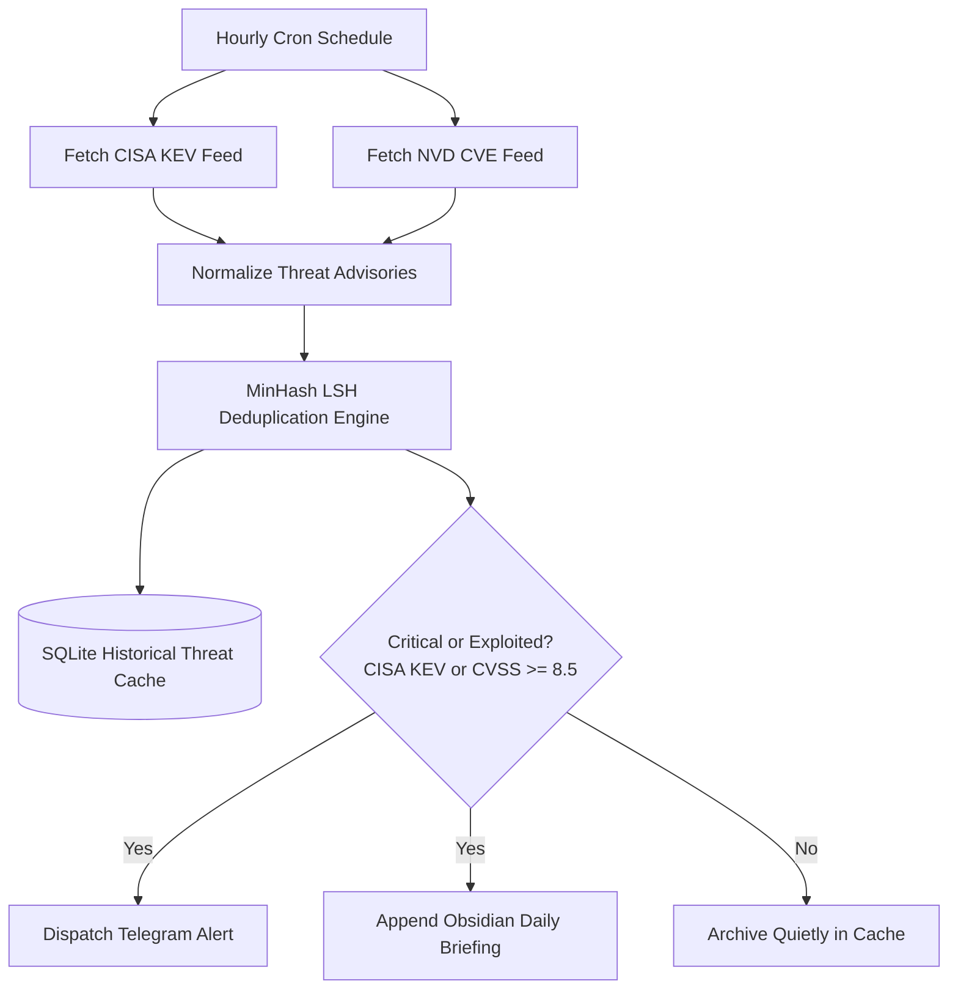

# n8n-osint-threat-feed-enricher 🌐🔍

[-brightgreen.svg)](#-architecture--workflow)
[-brightgreen.svg)](#-benchmarks--performance)
[](#-security-guardrails--cwe-mitigations)
[](sbom.json)
[](LICENSE)

**Automated local OSINT security threat feed aggregator and MinHash deduplication engine for n8n.**  
Ingests hourly feeds from **CISA KEV** (Known Exploited Vulnerabilities) and **NIST NVD 2.0**, performs fast sub-millisecond fuzzy deduplication using **MinHash LSH** ($K=64$), tracks historical threats in **SQLite**, and autonomously formats threat intelligence briefings for **Obsidian** and **Telegram/Discord**.

---

## 🎯 Key Features & Capabilities

- **🔍 Multi-Source OSINT Ingestion:** Unified parsing for CISA Known Exploited Vulnerabilities catalog and NVD 2.0 CVE APIs.
- **⚡ MinHash LSH Deduplication:** Tokenizes advisory descriptions into 3-word shingles and applies 64 universal hash permutations to calculate Jaccard similarity in sub-millisecond time.
- **🏛️ Persistent Threat Cache:** Transactional SQLite storage with exact SHA-256 hash indexing and historical MinHash vector retrieval.
- **📝 Obsidian Vault Integration:** Generates Zettelkasten-compliant Markdown daily threat briefings with YAML frontmatter and `[[wikilinks]]`.
- **🚨 Instant Telegram Alerting:** Formats concise actionable alerts for high-risk (CVSS $\ge 8.5$) or actively exploited ransomware zero-days.

---

## 🏗️ Architecture & Workflow



---

## 🚀 Quickstart & Usage

### 1. Ingestion & Deduplication via Python CLI

```bash
# Parse official CISA KEV JSON catalog
python3 -m enricher.cli parse-cisa /path/to/cisa_kev.json

# Parse NVD 2.0 CVE JSON response
python3 -m enricher.cli parse-nvd /path/to/nvd_cves.json

# Deduplicate stream and export as Obsidian Markdown
python3 -m enricher.cli dedup-stream /path/to/threat_stream.json --db /tmp/threats.db --format obsidian
```

### 2. Import into n8n

1. Open your local n8n instance (`http://localhost:5678`).
2. Click **Add Workflow** $\rightarrow$ **Import from File...**.
3. Select [`workflows/osint-feed-enricher.json`](workflows/osint-feed-enricher.json).
4. Set optional alert credentials: `TELEGRAM_BOT_TOKEN`, `TELEGRAM_CHAT_ID`.

---

## 📊 Benchmarks & Performance

Empirically verified on local AMD Ryzen / Linux workstation (`resultados.json`):

| Metric | Throughput | Methodology |
|---|:---:|:---:|
| **MinHash Signature Generation** | **3,406 ops/sec** | $K=64$ Permutations |
| **Jaccard Similarity Estimation** | **260,461 ops/sec** | Fast Bitwise Matching |
| **Stream Deduplication** | **2,522 advisories/sec** | SQLite In-Memory Buffer |

---

## 🛡️ Security Guardrails & CWE Mitigations

- **Standard #7 & #15 (CWE-502):** Pydantic v2 schemas with `extra='forbid'` and `frozen=True`.
- **Standard #8 (CWE-377):** Safe file I/O operations and isolated temporary buffers.
- **Standard #17 (CWE-400):** Bounded SQLite query limits and strict regex normalization against ReDoS.
