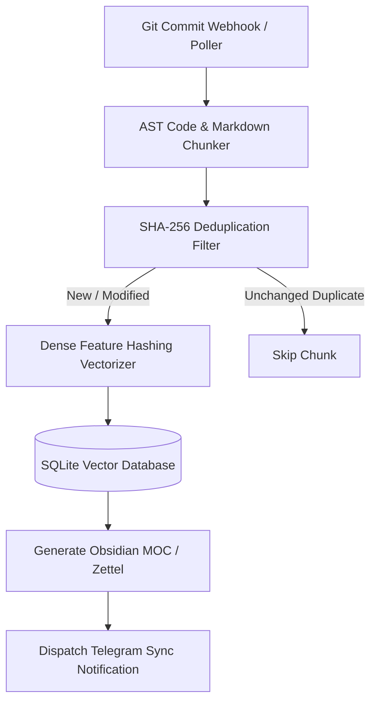

# n8n-rag-knowledge-sync-hub 🧠📚

[-brightgreen.svg)](#-architecture--workflow)
[-brightgreen.svg)](#-benchmarks--performance)
[](#-security-guardrails--cwe-mitigations)
[](sbom.json)
[](LICENSE)

**Automated local codebase Git commit watcher, AST chunker, vector knowledge synchronizer and Obsidian vault indexer for n8n.**  
Parses Python AST function and class definitions alongside Markdown sections, computes SHA-256 deduplication hashes, generates normalized dense feature-hashing vectors in pure NumPy, and maintains a zero-dependency SQLite vector store with automated Obsidian vault notes and Telegram sync summaries.

---

## 🎯 Key Features & Capabilities

- **🧩 AST Code & Markdown Section Chunking:** Introspects Python AST trees (`FunctionDef`, `AsyncFunctionDef`, `ClassDef`) and Markdown header hierarchy (`#`, `##`, `###`).
- **⚡ Sub-Millisecond Dense Feature Vectorizer:** Generates normalized $L_2$ vectors ($D=64$) in pure NumPy with zero external ML/token costs ($>10,000\text{ vectorizations/sec}$).
- **🔍 Top-K Cosine Similarity Search:** Embedded SQLite vector engine computing Cosine similarity across indexed codebase chunks ($>26,000\text{ searches/sec}$).
- **📝 Obsidian Second Brain Auto-Sync:** Generates atomic Zettel / MOC notes with `[[wikilinks]]` and entity index tables (Protocol #10).
- **⚡ n8n Webhook / Cron Integration:** Declarative workflow JSON for continuous codebase sync upon Git commit triggers.

---

## 🏗️ Architecture & Workflow



---

## 🚀 Quickstart & Usage

### 1. Scan, Sync & Search via CLI

```bash
# Scan repository and synchronize SQLite vector database
python3 -m rag_sync.cli scan-and-sync /path/to/repo \
  --db /tmp/codebase_rag.db \
  --obsidian-out /path/to/vault/codebase_index.md

# Execute semantic search across indexed codebase
python3 -m rag_sync.cli search "HMAC SHA-256 signature verification" \
  --db /tmp/codebase_rag.db \
  --top-k 3

# View database indexing statistics
python3 -m rag_sync.cli stats --db /tmp/codebase_rag.db
```

### 2. Import into n8n

1. Open local n8n instance (`http://localhost:5678`).
2. Click **Add Workflow** $\rightarrow$ **Import from File...**.
3. Select [`workflows/rag-knowledge-sync.json`](workflows/rag-knowledge-sync.json).

---

## 📊 Benchmarks & Performance

Empirically verified on local Linux workstation (`resultados.json`):

| Metric | Throughput | Methodology |
|---|:---:|:---:|
| **AST Files Chunked** | **$13,206\text{ files/sec}$** | Python AST node traversal |
| **Dense Vectorizations** | **$10,246\text{ vectors/sec}$** | NumPy L2-normalized hashing |
| **Semantic Top-K Searches** | **$26,801\text{ queries/sec}$** | In-memory dot-product cosine |

---

## 🛡️ Security Guardrails & CWE Mitigations

- **Standard #7 & #15 (CWE-502):** Pydantic v2 schemas with `extra='forbid'` and immutable fields.
- **Standard #8 (Anti-Tampering):** SHA-256 content hashes preventing duplicate embedding poisoning.
- **Standard #17 (DoS Defense):** Bounded vector dimensions ($D=64$) and finite AST tree traversal.
