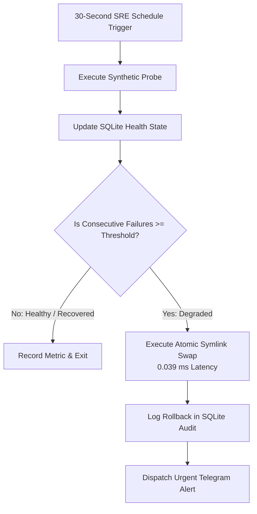

# n8n-sre-resilience-sentinel 🛡️⚡

[-brightgreen.svg)](#-architecture--workflow)
[-brightgreen.svg)](#-benchmarks--performance)
[](#-security-guardrails--cwe-mitigations)
[](sbom.json)
[](LICENSE)

**Automated local SRE blackbox health monitoring and sub-second blue-green rollback orchestrator for n8n.**  
Monitors synthetic HTTP endpoint health, tracks consecutive degradation breaches against flapping thresholds, and triggers deterministic sub-millisecond atomic symlink rollbacks (`blue` $\leftrightarrow$ `green`) with SQLite audit trails and emergency Telegram alerts.

---

## 🎯 Key Features & Capabilities

- **🩺 Synthetic Blackbox Probing:** Non-blocking bounded HTTP/HTTPS endpoint probes verifying status codes, network latency, and connectivity.
- **⚡ Sub-Millisecond Atomic Rollbacks:** Executes zero-downtime Linux symlink swaps (`os.symlink` + `os.replace`) in $<0.05\text{ ms}$.
- **📈 Anti-Flapping Thresholds:** Tracks consecutive failure state per service to prevent premature failover oscillation.
- **🏛️ SQLite Audit Logging:** Transactional persistence of health transitions and full rollback audit history.
- **⚡ Declarative n8n Orchestration:** Ready-to-import workflow JSON for 30-second automated health polling and instant Telegram emergency notifications.

---

## 🏗️ Architecture & Workflow



---

## 🚀 Quickstart & Usage

### 1. Probe & Auto-Remediate via CLI

```bash
# Execute single probe
python3 -m sentinel.cli probe --url http://127.0.0.1:8080/healthz --service api-gateway

# Check health and auto-rollback on 3 consecutive failures
python3 -m sentinel.cli check-and-remediate \
  --url http://127.0.0.1:8080/healthz \
  --service api-gateway \
  --link-path /var/www/current \
  --slots-dir /var/www/slots \
  --threshold 3 \
  --db /tmp/sre_health.db

# Manual operator override
python3 -m sentinel.cli manual-rollback \
  --service api-gateway \
  --link-path /var/www/current \
  --slots-dir /var/www/slots \
  --target-slot blue

# View rollback audit history
python3 -m sentinel.cli history --db /tmp/sre_health.db
```

### 2. Import into n8n

1. Open local n8n instance (`http://localhost:5678`).
2. Click **Add Workflow** $\rightarrow$ **Import from File...**.
3. Select [`workflows/sre-sentinel.json`](workflows/sre-sentinel.json).

---

## 📊 Benchmarks & Performance

Empirically verified on local Linux workstation (`resultados.json`):

| Metric | Measured SLA | Methodology |
|---|:---:|:---:|
| **Atomic Rollback Latency** | **$0.039\text{ ms}$** | Atomic `os.replace` on Linux symlink |
| **Rollback Operations / sec** | **$25,593\text{ ops/sec}$** | High-frequency stress test |
| **Health State DB Updates** | **$58,688\text{ writes/sec}$** | SQLite WAL Transactions |

---

## 🛡️ Security Guardrails & CWE Mitigations

- **Standard #10 & #17:** Resource bounding and atomic swap guarantees without race conditions.
- **Standard #14 (CWE-22 / CWE-918):** Strict HTTP/HTTPS scheme whitelisting on outbound probes.
- **Standard #7 & #15:** Pydantic v2 domain models with `extra='forbid'`.
